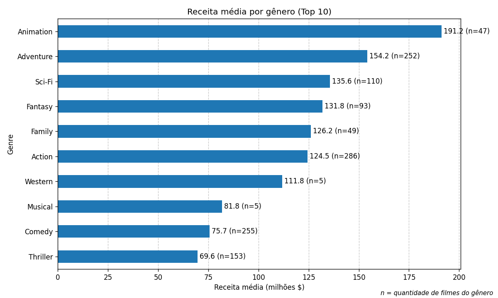
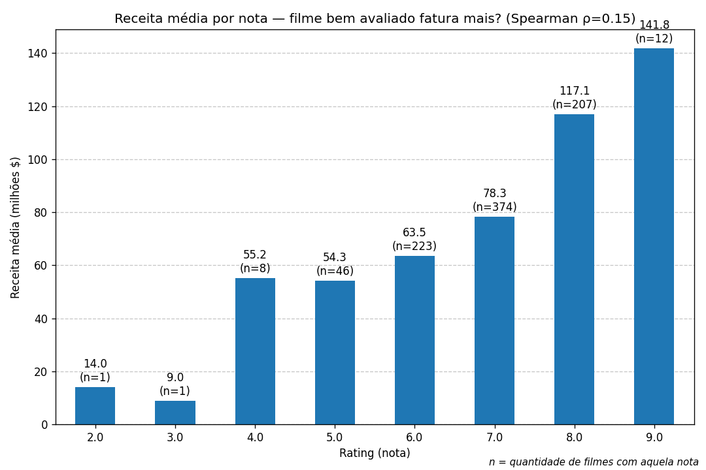
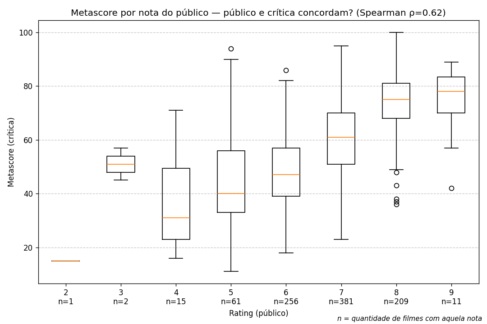

# Desafio Técnico Looqbox — Analista de Dados e BI

**Candidato:** Vinicius Henrique Albino Andrade

---

## Como executar

- **Stack:** Python 3.14, MySQL, SQLAlchemy + PyMySQL, pandas, matplotlib
- **Credenciais:** carregadas de um arquivo `.env` (template em `.env.example`); nunca versionadas (`.gitignore`)
- **Instalação:** `pip install -r requirements.txt`
- **Conexão isolada:** `db.py` centraliza a criação do engine via `URL.create` (escapa caracteres especiais do nome do schema/usuário) com `pool_pre_ping=True` como safeguard

```
data-challenge/
├── db.py                       # conexão isolada (engine único, reutilizável)
├── .env.example                # template das variáveis
├── requirements.txt
├── sql_test/
│   ├── query1.sql
│   ├── query2.sql
│   └── query3.sql
├── case1_retrieve_data.py
├── case2_visualization.py
└── case3_imdb.py
```

---

## SQL Test

### Query 1 — Os 10 produtos mais caros

```sql
SELECT dp.PRODUCT_COD, dp.PRODUCT_NAME, dp.PRODUCT_VAL
FROM `looqbox-challenge`.data_product dp
ORDER BY dp.PRODUCT_VAL DESC, dp.PRODUCT_COD ASC
LIMIT 10;
```

**Resultado:**

| PRODUCT_COD | PRODUCT_NAME                                                    | PRODUCT_VAL |
| ----------- | --------------------------------------------------------------- | ----------- |
| 301409      | Whisky Escoces THE MACALLAN Ruby Garrafa 700ml com Caixa        | 741.99      |
| 176185      | Whisky Escoces JOHNNIE WALKER Blue Label Garrafa 750ml          | 735.90      |
| 315481      | Cafeteira Expresso 3 CORACOES Tres Modo Vermelho                | 499.00      |
| 100280      | Vinho Portugues Tinto Vintage QUINTA DO CRASTO Garrafa 750ml    | 445.90      |
| 320046      | Escova Dental Eletrica ORAL B D34 Professional Care 5000 110v   | 399.90      |
| 190817      | Champagne Rose VEUVE CLICQUOT PONSARDIM Garrafa 750ml           | 366.90      |
| 153795      | Champagne Frances Brut Imperial MOET Rose Garrafa 750ml         | 359.90      |
| 311397      | Conjunto de Panelas Allegra em Inox TRAMONTINA 5 Pecas          | 359.00      |
| 147706      | Whisky Escoces CHIVAS REGAL 18 Anos Garrafa 750ml               | 329.90      |
| 44311       | Champagne Frances Demi Sec Nectar Imperial MOET & CHANDON 750ml | 315.90      |

**Decisão de design — desempate determinístico:**
O 10º e o 11º produtos empatam em preço (R$ 315,90 — há duas Champagnes MOET). Mantive `LIMIT 10` conforme o enunciado e adicionei `PRODUCT_COD` como critério de desempate no `ORDER BY`. Sem esse critério, o MySQL poderia retornar produtos diferentes entre execuções; no caso de empate o desempate garante **resultado reproduzível**.

Caso o requisito fosse incluir todos os empatados no 10º valor, usaria `DENSE_RANK() <= 10`.

---

### Query 2 — Seções dos departamentos BEBIDAS e PADARIA

```sql
SELECT DISTINCT dp.DEP_NAME, dp.SECTION_NAME
FROM `looqbox-challenge`.data_product dp
WHERE dp.DEP_NAME IN ('BEBIDAS', 'PADARIA')
ORDER BY dp.DEP_NAME;
```

**Resultado:**

| DEP_NAME | SECTION_NAME       |
| -------- | ------------------ |
| BEBIDAS  | BEBIDAS            |
| BEBIDAS  | CERVEJAS           |
| BEBIDAS  | REFRESCOS          |
| BEBIDAS  | VINHOS             |
| PADARIA  | DOCES-E-SOBREMESAS |
| PADARIA  | GESTANTE           |
| PADARIA  | PADARIA            |
| PADARIA  | QUEIJOS-E-FRIOS    |

**Decisões:**

- `DISTINCT` elimina a duplicação: cada seção se repete uma vez por produto, então sem o `DISTINCT` a mesma seção apareceria várias vezes.
- **Verificação prévia:** antes de finalizar, listei todos os departamentos para garantir que não havia variações de nome que deveriam ser incluídas.

---

### Query 3 — Venda total por Business Area no 1º trimestre de 2019

```sql
SELECT   dsc.BUSINESS_NAME,
         SUM(dps.SALES_VALUE) AS TOTAL_VENDA
FROM     `looqbox-challenge`.data_product_sales dps
JOIN     `looqbox-challenge`.data_store_cad dsc
         ON CAST(dps.STORE_CODE AS UNSIGNED) = dsc.STORE_CODE
WHERE    dps.`DATE` BETWEEN '2019-01-01' AND '2019-03-31'
GROUP BY dsc.BUSINESS_NAME
ORDER BY TOTAL_VENDA DESC;
```

**Resultado:**

| BUSINESS_NAME | TOTAL_VENDA   |
| ------------- | ------------- |
| Farma         | 81.776.691,73 |
| Varejo        | 81.032.347,65 |
| Atacado       | 80.384.884,60 |
| Proximidade   | 80.171.122,80 |
| Posto         | 32.072.326,40 |

**Decisões técnicas:**

- **Mismatch de tipo no JOIN:** `STORE_CODE` é `varchar` em `data_product_sales` e `int` em `data_store_cad`. Apliquei `CAST(dps.STORE_CODE AS UNSIGNED)` para alinhar os tipos no JOIN.
- **Filtro de período:** `DATE` é tipo `DATE` (sem hora), então `BETWEEN '2019-01-01' AND '2019-03-31'` inclui o dia 31/03 integralmente.
- **INNER JOIN:** adequado aqui, uma venda cujo `STORE_CODE` não exista no cadastro não tem Business Area atribuível, logo deve ficar de fora da agregação por área.
- Observação de negócio: "Posto" fatura bem menos que as demais áreas (~32M vs ~80M), coerente com o menor mix de produtos de um posto.

---

## Case 1 — Função dinâmica `retrieve_data`

```python
import pandas as pd
from sqlalchemy import text
from db import get_engine

engine = get_engine()

def retrieve_data(product_code=None, store_code=None, date=None):
    store_code_param = None if store_code is None else str(store_code)

    filtros = [
        (product_code, "PRODUCT_CODE = :pcode", {"pcode": product_code}),
        (store_code,   "STORE_CODE = :scode",   {"scode": store_code_param}),
    ]

    ativos = [f for f in filtros if f[0] is not None]

    if date is not None:
        if not isinstance(date, (list, tuple)) or len(date) != 2:
            raise ValueError(
                "date deve ser uma lista com exatamente 2 elementos: [inicio, fim]."
            )
        ativos.append(
            (date, "DATE BETWEEN :ini AND :fim", {"ini": date[0], "fim": date[1]})
        )

    if not ativos:
        raise ValueError(
            "Informe ao menos um filtro: product_code, store_code ou date."
        )

    where = "WHERE " + " AND ".join(trecho for _, trecho, _ in ativos)

    params = {}
    for _, _, p in ativos:
        params.update(p)

    query = f"SELECT * FROM data_product_sales {where}"
    return pd.read_sql(text(query), engine, params=params)
```

**Exemplos de uso e resultados (linhas retornadas):**

| Chamada                                                                             | Resultado                                 |
| ----------------------------------------------------------------------------------- | ----------------------------------------- |
| `retrieve_data(product_code=67108)`                                                 | 35.762 linhas                             |
| `retrieve_data(store_code=1)`                                                       | 136.729 linhas                            |
| `retrieve_data(date=['2019-01-01','2019-01-31'])`                                   | 39.401 linhas                             |
| `retrieve_data(product_code=67108, store_code=1, date=['2019-01-01','2019-03-31'])` | combinação dos filtros                    |
| `retrieve_data()`                                                                   | levanta `ValueError` (ver decisão abaixo) |
| `retrieve_data(product_code=301409)`                                                | 0 linhas (ver insight)                    |

**Decisões de design:**

- **Filtros opcionais declarativos:** construo a cláusula `WHERE` iterando sobre uma lista de filtros, em vez de uma cadeia de `if`. Evita repetição e facilita adicionar novos filtros.
- **`is not None`:** `if product_code:` trataria `0` como ausente; `is not None` checa literalmente se o filtro foi informado, independente do valor.
- **Query parametrizada:** uso placeholders (`:pcode`, etc.) e passo os valores separadamente. Como o enunciado diz que "outros times vão usar a função", isso protege contra SQL Injection.
- **Exige ao menos um filtro:** sem nenhum filtro, levanto `ValueError`. `data_product_sales` é uma tabela transacional grande; retornar tudo sem filtro seria arriscado (memória/performance). Forçar uso intencional é o comportamento mais seguro para quem chama.
- **Tratamento do varchar:** `STORE_CODE` é `varchar` na tabela; converto o parâmetro para `str` para garantir o match.
- **Conexão reutilizável:** o engine é criado uma vez (nível de módulo) e reutilizado, em vez de recriado a cada chamada.

**Insight de negócio:** o produto mais caro da empresa (THE MACALLAN, código 301409) tem **zero vendas**, enquanto produtos de baixo valor (ex.: 67108) vendem mais de 35 mil vezes — coerente com o comportamento de um item de luxo.

---

## Case 2 — Ticket Médio por Loja/Categoria

As duas queries fornecidas foram usadas **exatamente como recebidas** (sem modificação). Como a Query 2 traz o ano inteiro e o pedido é o período `['2019-10-01','2019-12-31']`, o **filtro do 4º trimestre é feito no pandas** — respeitando a restrição de não alterar a query.

```python
import pandas as pd
from sqlalchemy import text
from db import get_engine

engine = get_engine()

query_lojas = text("""
SELECT STORE_CODE, STORE_NAME, START_DATE, END_DATE, BUSINESS_NAME, BUSINESS_CODE
FROM data_store_cad
""")

query_vendas = text("""
SELECT STORE_CODE, DATE, SALES_VALUE, SALES_QTY
FROM data_store_sales
WHERE DATE BETWEEN '2019-01-01' AND '2019-12-31'
""")

df_lojas = pd.read_sql(query_lojas, engine)
df_vendas = pd.read_sql(query_vendas, engine)

# Filtro do 4º trimestre no pandas (a query não pode ser modificada)
df_vendas["DATE"] = pd.to_datetime(df_vendas["DATE"])
q4 = df_vendas[(df_vendas["DATE"] >= "2019-10-01") & (df_vendas["DATE"] <= "2019-12-31")]

# Agregação por loja e Ticket Médio = soma(valor) / soma(qtd)
agg = q4.groupby("STORE_CODE").agg(
    valor_total=("SALES_VALUE", "sum"),
    qtd_total=("SALES_QTY", "sum"),
).reset_index()
agg["TM"] = (agg["valor_total"] / agg["qtd_total"]).round(2)

final = agg.merge(df_lojas, on="STORE_CODE")
resultado = final[["STORE_NAME", "BUSINESS_NAME", "TM"]]
resultado.columns = ["Loja", "Categoria", "TM"]
resultado = resultado.sort_values("Loja").reset_index(drop=True)
print(resultado)
```

**Resultado (confere 100% com a tabela esperada do enunciado):**

| Loja           | Categoria   | TM    |
| -------------- | ----------- | ----- |
| Bahia          | Atacado     | 15.39 |
| Bangkok        | Posto       | 13.67 |
| Belem          | Proximidade | 15.37 |
| Berlin         | Proximidade | 15.39 |
| Buenos Aires   | Atacado     | 15.39 |
| Chicago        | Varejo      | 15.53 |
| Dubai          | Atacado     | 15.39 |
| Hong Kong      | Farma       | 26.35 |
| London         | Farma       | 28.99 |
| Madri          | Farma       | 29.03 |
| Miami          | Posto       | 13.67 |
| New York       | Proximidade | 15.39 |
| Paris          | Proximidade | 15.39 |
| Rio de Janeiro | Farma       | 29.59 |
| Roma           | Varejo      | 15.39 |
| Salvador       | Atacado     | 15.39 |
| Sao Paulo      | Varejo      | 15.39 |
| Sidney         | Posto       | 13.67 |
| Tokio          | Varejo      | 15.39 |
| Vancouver      | Posto       | 13.67 |

**Decisões:**

- **Restrição respeitada:** as queries foram usadas sem qualquer alteração; o recorte do trimestre acontece na camada de aplicação.
- **Ticket Médio = soma(valor) / soma(qtd)** sobre o período, **não** a média das razões diárias. A média das médias daria peso igual a dias de volume diferente, distorcendo o ticket. O agregado (soma/soma) é o ticket médio correto.
- **Merge por `STORE_CODE`:** ambos são `int` nas duas tabelas, então o merge é direto (sem o problema de tipo do Case 1).

---

## Case 3 — Visualizações (tabela `IMDB_movies`)

Os três gráficos respondem, juntos, a uma pergunta: **o que se relaciona com o sucesso de um filme?** Em todos, valores ausentes (`NULL`) são removidos antes da análise, e a quantidade de filmes (`n`) é exibida para evitar conclusões a partir de amostras pequenas.

### Gráfico 1 — Receita média por gênero



**Por quê:** gráfico de barras compara categorias discretas (gêneros). A coluna `Genre` é multivalorada ("Action,Adventure,Sci-Fi"); apliquei `split` + `explode` para gerar uma linha por gênero e analisar cada um individualmente. O `n` ao lado de cada barra evita interpretar uma média baseada em poucos filmes como representativa.

### Gráfico 2 — Receita média por nota (Rating)



**Por quê:** `Rating` contém apenas valores inteiros, então agreguei a receita média por nota. Incluí o coeficiente de **Spearman** (correlação de postos, apropriada para variável ordinal inteira) para quantificar a relação entre nota e receita e o `n` por nota para sinalizar onde a média é frágil.

**Spearman ρ = 0,15** — correlação **fraca**: a nota de um filme tem pouca relação com a receita. Ou seja, filme bem avaliado não necessariamente fatura mais, outros fatores como marketing, franquia ou distribuição podem pesar mais na bilheteria.

### Gráfico 3 — Público (Rating) vs Crítica (Metascore)



**Por quê:** boxplot do `Metascore` (crítica) para cada nota do público mostra, pela forma, se as avaliações sobem juntas. O **Spearman** quantifica a concordância, e o `n` por caixa evita interpretar uma caixa de um único filme como tendência.

**Spearman ρ = 0,62**, correlação **moderada-positiva**: público e crítica concordam razoavelmente (notas altas do público tendem a ter Metascore alto), mas a concordância não é perfeita, há filmes amados pelo público e mornos para a crítica, e vice-versa.

**Nota analítica (receita):** usei **média** de receita. Estou ciente de que receita é assimétrica (poucos blockbusters inflam a média); em uma análise de produção, consideraria a **mediana** para representar a receita típica.

---

## Uso de Inteligência Artificial

Utilizei assistência de IA (Claude) como **apoio de mentoria**: para esclarecer conceitos, revisar minha lógica e apontar bugs.

As queries SQL, a função `retrieve_data`, as transformações em pandas e as visualizações foram **escritas e compreendidas por mim**. Testei cada etapa diretamente contra o banco e validei os resultados. Onde já tinha conhecimento (SQL, pandas) apliquei diretamente; onde tive dúvida conceitual, pesquisei e confirmei o entendimento antes de implementar.
