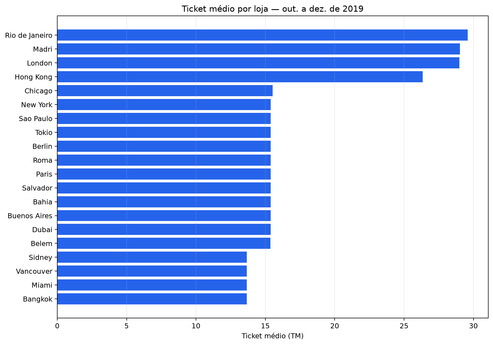
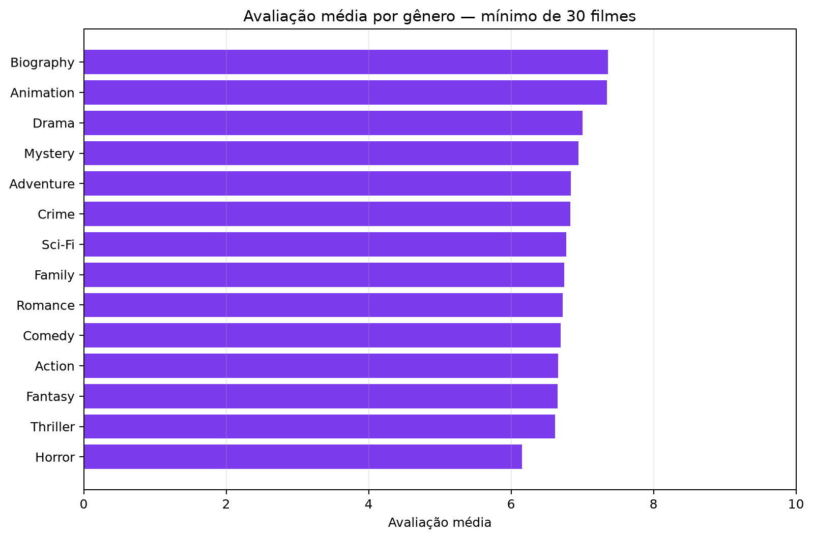

# Looqbox Data Challenge — Relatório

**Candidato:** Raul Martins
**Data:** 14/08/2026
**Schema:** `looqbox_challenge` (MySQL)

Este relatório documenta as consultas SQL, os dois casos práticos e a visualização livre pedidos no desafio, com o código utilizado, os resultados obtidos contra o banco real e a validação de cada etapa. O código-fonte completo está em `src/`, as queries em `sql/`, os notebooks de validação em `notebooks/` e os dados/gráficos gerados em `outputs/`.

---

## 1. SQL test

Todas as consultas rodam contra o schema `looqbox_challenge` e foram validadas de ponta a ponta via [`src/run_sql_questions.py`](../src/run_sql_questions.py), que executa cada arquivo `sql/question_*.sql` e salva o resultado em `outputs/tables/`.

### 1.1 — Os 10 produtos mais caros da empresa

```sql
SELECT
    PRODUCT_COD,
    PRODUCT_NAME,
    PRODUCT_VAL
FROM data_product
ORDER BY PRODUCT_VAL DESC
LIMIT 10;
```

| PRODUCT_COD | PRODUCT_NAME | PRODUCT_VAL |
|---|---|---|
| 301409 | Whisky Escoces THE MACALLAN Ruby Garrafa 700ml com Caixa | 741.99 |
| 176185 | Whisky Escoces JOHNNIE WALKER Blue Label Garrafa 750ml | 735.90 |
| 315481 | Cafeteira Expresso 3 CORACOES Tres Modo Vermelho | 499.00 |
| 100280 | Vinho Portugues Tinto Vintage QUINTA DO CRASTO Garrafa 750ml | 445.90 |
| 320046 | Escova Dental Eletrica ORAL B D34 Professional Care 5000 110v | 399.90 |
| 190817 | Champagne Rose VEUVE CLICQUOT PONSARDIM Garrafa 750ml | 366.90 |
| 153795 | Champagne Frances Brut Imperial MOET Rose Garrafa 750ml | 359.90 |
| 311397 | Conjunto de Panelas Allegra em Inox TRAMONTINA 5 Pecas Gratis Utensilios 5 Pecas | 359.00 |
| 147706 | Whisky Escoces CHIVAS REGAL 18 Anos Garrafa 750ml | 329.90 |
| 154431 | Champagne Frances Brut Imperial MOET & CHANDON Garrafa 750ml | 315.90 |

**Validação:** `data_product` já está no grão de produto (uma linha por `PRODUCT_COD`), então ordenar por `PRODUCT_VAL` decrescente e limitar a 10 é suficiente — não há risco de duplicidade nem necessidade de `DISTINCT`.

### 1.2 — Seções dos departamentos 'BEBIDAS' e 'PADARIA'

```sql
SELECT DISTINCT
    DEP_NAME,
    SECTION_COD,
    SECTION_NAME
FROM data_product
WHERE DEP_NAME IN ('BEBIDAS', 'PADARIA')
ORDER BY DEP_NAME, SECTION_NAME;
```

| DEP_NAME | SECTION_COD | SECTION_NAME |
|---|---|---|
| BEBIDAS | 4 | BEBIDAS |
| BEBIDAS | 29 | CERVEJAS |
| BEBIDAS | 31 | REFRESCOS |
| BEBIDAS | 30 | VINHOS |
| PADARIA | 8 | DOCES-E-SOBREMESAS |
| PADARIA | 27 | GESTANTE |
| PADARIA | 19 | PADARIA |
| PADARIA | 22 | QUEIJOS-E-FRIOS |

**Validação:** o `DISTINCT` é necessário porque `data_product` tem uma linha por produto — sem ele, a query devolveria uma linha repetida por produto em vez de uma por combinação departamento/seção. O resultado mostra 4 seções em cada departamento, sem repetição.

### 1.3 — Total de vendas (R$) por Área de Negócio no 1º trimestre de 2019

```sql
SELECT
    store.BUSINESS_CODE,
    store.BUSINESS_NAME,
    SUM(sales.SALES_VALUE) AS TOTAL_SALES_VALUE
FROM data_product_sales AS sales
INNER JOIN data_store_cad AS store
    ON store.STORE_CODE = sales.STORE_CODE
WHERE sales.DATE >= '2019-01-01'
  AND sales.DATE < '2019-04-01'
GROUP BY
    store.BUSINESS_CODE,
    store.BUSINESS_NAME
ORDER BY TOTAL_SALES_VALUE DESC;
```

| BUSINESS_CODE | BUSINESS_NAME | TOTAL_SALES_VALUE |
|---|---|---|
| 4 | Farma | 81.776.691,73 |
| 1 | Varejo | 81.032.347,65 |
| 5 | Atacado | 80.384.884,60 |
| 2 | Proximidade | 80.171.122,80 |
| 3 | Posto | 32.072.326,40 |

**Validação:** o filtro de data usa `>= '2019-01-01' AND < '2019-04-01'` (intervalo meio-aberto) em vez de `BETWEEN ... AND '2019-03-31'`, para não correr risco de excluir vendas do último dia caso a coluna carregasse horário. `INNER JOIN` é adequado porque só interessam vendas associadas a uma loja válida em `data_store_cad`. As áreas de negócio ficam bem próximas entre si (exceto Posto, nitidamente menor), sem nenhum valor discrepante que sugira erro de junção.

---

## 2. Case 1 — Função dinâmica de retrieval

**Pedido:** uma função `retrieve_data(product_code, store_code, date)` que monte a consulta dinamicamente a partir de filtros opcionais, retorne todas as colunas de `data_product_sales`, e seja segura para uso por outros times.

**Implementação:** [`src/retrieve_data.py`](../src/retrieve_data.py)

```python
def retrieve_data(engine, product_code=None, store_code=None, date_range=None):
    clauses, parameters = [], {}

    if product_code is not None:
        clauses.append("PRODUCT_CODE = :product_code")
        parameters["product_code"] = product_code
    if store_code is not None:
        clauses.append("STORE_CODE = :store_code")
        parameters["store_code"] = store_code
    if date_range is not None:
        if len(date_range) != 2:
            raise ValueError("date_range must contain exactly a start date and an end date")
        start_date, end_date = (date.fromisoformat(v) for v in date_range)
        if start_date > end_date:
            raise ValueError("date_range start date cannot be after the end date")
        clauses.append("DATE BETWEEN :start_date AND :end_date")
        parameters.update(start_date=start_date, end_date=end_date)

    query = "SELECT * FROM data_product_sales"
    if clauses:
        query += " WHERE " + " AND ".join(clauses)

    return pd.read_sql_query(text(query), engine, params=parameters)
```

**Decisões de design:**

- **Todos os parâmetros são opcionais.** Isso dá a flexibilidade pedida no enunciado — a função aceita qualquer combinação de filtros (só produto, só loja, só data, todos juntos, ou nenhum).
- **Query parametrizada** (`:product_code`, `:store_code`, `:start_date`, `:end_date` como bind parameters do SQLAlchemy), nunca concatenação de string. Como a função é feita para ser usada por outros times, os valores de entrada não são confiáveis por padrão — parametrizar elimina o risco de SQL injection.
- **Validação explícita de `date_range`**: exige lista de exatamente 2 elementos, valida formato ISO (`date.fromisoformat`) e ordem cronológica, falhando com `ValueError` claro em vez de gerar uma query quebrada ou um resultado silenciosamente errado.
- **`SELECT *`** atende à instrução extra de retornar todas as colunas de `data_product_sales`.
- **`engine` é recebido como parâmetro**, não criado dentro da função — quem chama controla e reutiliza a conexão.

**Exemplos de chamada:**

```python
retrieve_data(engine, date_range=['2019-01-01', '2019-01-31'])
retrieve_data(engine, product_code=18)
retrieve_data(engine, store_code=1)
retrieve_data(engine, product_code=18, store_code=1, date_range=['2019-01-01', '2019-01-31'])
```

**Validação** (ver [`notebooks/case_01.ipynb`](../notebooks/case_01.ipynb) para a execução completa contra o banco real):

- Filtrando só por `product_code=18`: 5.840 linhas.
- Filtrando só por `store_code=1`: 136.729 linhas. Vale registrar que `STORE_CODE` está tipado como `VARCHAR(255)` em `data_product_sales` (diferente de `data_store_cad`/`data_store_sales`, onde é `INTEGER`) — testamos de propósito passando um `int` e confirmamos que o MySQL converte corretamente na comparação.
- Combinando os três filtros (`product_code=18`, `store_code=1`, janeiro/2019): exatamente 31 linhas, uma por dia do mês — confirma que as cláusulas são combinadas com `AND`.
- Três entradas inválidas testadas (lista de data com 1 elemento, data inicial após a final, formato fora do ISO) — todas rejeitadas com `ValueError` e mensagem clara.
- Sem nenhum filtro, a função devolveria as 2.173.133 linhas da tabela inteira (dados de 2014-11-23 a 2019-12-31) — validamos essa contagem via `COUNT(*)` sem de fato puxar a tabela completa no notebook, para não sobrecarregar a conexão à toa.

---

## 3. Case 2 — Visualização de ticket médio por loja

**Pedido:** usar duas queries prontas sem modificá-las, filtrar o período `2019-10-01` a `2019-12-31` em Python, e reproduzir a visualização de ticket médio (TM) por loja/categoria do enunciado.

**Queries usadas exatamente como fornecidas** (nenhuma coluna, filtro ou alias alterado):

```sql
SELECT STORE_CODE, STORE_NAME, START_DATE, END_DATE, BUSINESS_NAME, BUSINESS_CODE
FROM data_store_cad
```

```sql
SELECT STORE_CODE, DATE, SALES_VALUE, SALES_QTY
FROM data_store_sales
WHERE DATE BETWEEN '2019-01-01' AND '2019-12-31'
```

**Pipeline** (código completo e execução em [`notebooks/case_02.ipynb`](../notebooks/case_02.ipynb) e [`src/case_02.py`](../src/case_02.py)):

1. Filtra `2019-10-01` a `2019-12-31` em Pandas sobre o resultado de `QUERY_SALES` (1.840 linhas).
2. Junta com `data_store_cad` por `STORE_CODE`, usando `validate='many_to_one'` — garante que cada venda casa com exatamente uma loja (nenhuma linha ficou sem correspondência, e não há `STORE_CODE` duplicado em `data_store_cad`).
3. Verifica nulos e quantidade zero em `SALES_VALUE`/`SALES_QTY` — não há nenhum caso no período filtrado, então nenhuma loja precisou ser descartada (o código remove `SALES_QTY = 0` de qualquer forma, por segurança).
4. Agrega por loja, soma `SALES_VALUE` e `SALES_QTY`, e calcula `TM = soma(SALES_VALUE) / soma(SALES_QTY)` — o ticket médio real, não a média dos tickets diários.

**Resultado** (bate exatamente com a tabela de referência do enunciado):

| Loja | Categoria | TM |
|---|---|---|
| Bahia | Atacado | 15.39 |
| Bangkok | Posto | 13.67 |
| Belem | Proximidade | 15.37 |
| Berlin | Proximidade | 15.39 |
| Buenos Aires | Atacado | 15.39 |
| Chicago | Varejo | 15.53 |
| Dubai | Atacado | 15.39 |
| Hong Kong | Farma | 26.35 |
| London | Farma | 28.99 |
| Madri | Farma | 29.03 |
| Miami | Posto | 13.67 |
| New York | Proximidade | 15.39 |
| Paris | Proximidade | 15.39 |
| Rio de Janeiro | Farma | 29.59 |
| Roma | Varejo | 15.39 |
| Salvador | Atacado | 15.39 |
| Sao Paulo | Varejo | 15.39 |
| Sidney | Posto | 13.67 |
| Tokio | Varejo | 15.39 |
| Vancouver | Posto | 13.67 |



**Interpretação:** lojas da categoria Farma têm ticket médio nitidamente mais alto (Rio de Janeiro 29.59, Madri 29.03, London 28.99, Hong Kong 26.35), coerente com o preço unitário mais alto de itens de farmácia. Posto é a categoria com menor TM (13.67, igual em todas as lojas). As demais categorias (Atacado, Varejo, Proximidade) ficam concentradas perto de 15.4, com pouca variação entre lojas da mesma categoria.

---

## 4. Case 3 — Visualização livre (IMDB_movies)

**Pergunta escolhida:** qual gênero tem a melhor avaliação média no IMDB, entre os gêneros com representação suficiente na base (≥30 filmes)?

**Por que essa pergunta:** `Genre` e `Rating` estão 100% preenchidos na tabela (nenhuma decisão de imputação necessária), e comparar gêneros é uma pergunta de negócio direta. `Genre` é multi-rótulo (ex.: `"Action,Adventure,Sci-Fi"`), então cada filme conta para todos os gêneros aos quais pertence. O limite mínimo de 30 filmes evita que gêneros raros distorçam o ranking com médias de amostra pequena.

**Exploração de qualidade dos dados** (ver [`notebooks/case_03.ipynb`](../notebooks/case_03.ipynb)): 1.000 filmes, sem `Id` duplicado. `Genre` e `Rating` sem nenhum valor nulo; `RevenueMillions` (128 nulos) e `Metascore` (64 nulos) não entram nesta análise. `Rating` está tipado como `DECIMAL(10,0)` no banco — as notas já vêm arredondadas para inteiro (ex.: 8, não 8.1) —, o que limita a precisão da média calculada; é uma característica dos dados de origem, não um problema introduzido pela análise.

**Colunas selecionadas:** `Id`, `Genre`, `Rating` — apenas o necessário para a pergunta.

**Processamento:** `Genre` é explodido por vírgula (`str.split(',').explode()`) e cada valor é limpo com `strip()`; agrupa por gênero, calcula número de filmes e avaliação média, e filtra apenas gêneros com ≥30 filmes.

**Resultado:**

| Genre | Filmes | Avaliação média |
|---|---|---|
| Biography | 81 | 7.36 |
| Animation | 49 | 7.35 |
| Drama | 513 | 7.01 |
| Mystery | 106 | 6.94 |
| Adventure | 259 | 6.84 |
| Crime | 150 | 6.83 |
| Sci-Fi | 120 | 6.78 |
| Family | 51 | 6.75 |
| Romance | 141 | 6.72 |
| Comedy | 279 | 6.70 |
| Action | 303 | 6.66 |
| Fantasy | 101 | 6.65 |
| Thriller | 195 | 6.62 |
| Horror | 119 | 6.15 |



**Por que esse gráfico:** barras horizontais, porque a pergunta é comparativa entre categorias — os nomes dos gêneros ficam legíveis sem rotacionar texto, e a ordenação por valor deixa o ranking evidente.

**Interpretação:** Biography (7.36) e Animation (7.35) lideram, seguidos por Drama (7.01) — únicos três acima de 7. Horror (6.15) é o pior avaliado entre os gêneros com representação suficiente. A diferença entre topo e base do ranking é de pouco mais de 1.2 pontos (escala 0–10) — relevante, mas a maioria dos gêneros populares (Drama, Adventure, Crime, Sci-Fi, Comedy, Action) fica concentrada entre 6.6 e 7.0.

---

## 5. Divulgação de uso de IA

Usei o Claude Code (assistente de IA da Anthropic) como apoio ao longo do desafio, mas com autoria e decisões técnicas minhas em cada etapa:

- **Consultas SQL (seção 1):** escrevi as 3 queries eu mesmo. A IA foi usada só para validá-las contra o banco real e corrigir eventuais erros de sintaxe.
- **Casos práticos em Python (Case 1 e Case 2):** eu expliquei toda a abordagem e a lógica a serem usadas — a parametrização segura e a validação de `date_range` do `retrieve_data` (Case 1), e o filtro de período, join, agregação e cálculo do ticket médio (Case 2) — e a IA ajudou a escrever o código a partir dessas instruções.
- **Visualização livre (Case 3, IMDB_movies):** estudei os dados eu mesmo e propus a pergunta e a análise, considerando que essa é uma entre as abordagens possíveis para esse dataset — não a única "correta".
- **Formatação final:** usei a IA para gerar o PDF e organizar a apresentação do relatório, deixando-o mais claro e visualmente polido.

Todos os resultados numéricos apresentados (contagens de linhas, valores de TM, avaliações médias) vêm de execuções reais contra o banco de dados do desafio — cada um foi conferido contra os dados de referência do enunciado (tabela do Case 2) ou contra contagens/consultas independentes (Case 1 e Case 3).
